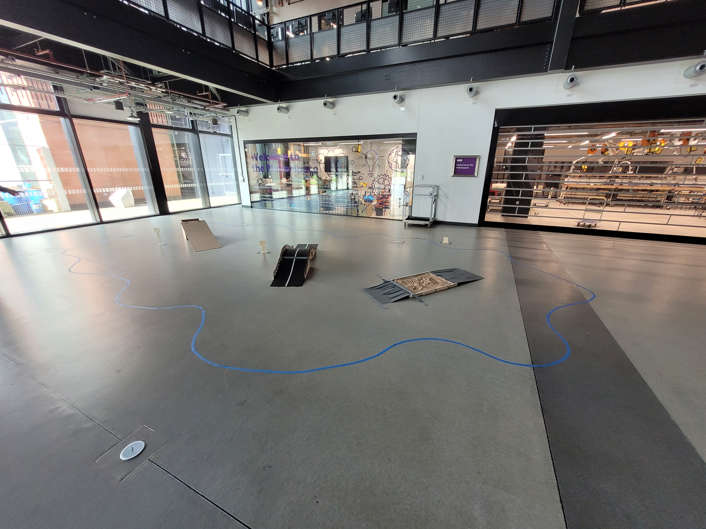

# Hackabot24-Team5
Check out the GitHub repo for Team 5's Teleoperated Extraterrestrial Rover from the University of Manchester HackABot2024 event.

# Challenge
Create a Teleoperated Extraterrestrial Rover for Completing a Series of Tasks. 

Within a 24-hour time limit, tasks included:

- Task 1: Teleoperating the robot to follow a designated path, maneuvering through diverse terrains such as sand, ramps, and bridges.
- Task 2: Remote operation of the robot using live camera data to contain and push ping-pong balls scattered across the arena into a central pit. Implemented color detection algorithms to identify the color of the ping-pong balls.
- Task 3: Conducting the final demonstration to exhibit the successful completion of all tasks and showcasing the innovations achieved within the allocated time frame at the University of Manchester's HackABot2024 event.

The Arena:

# Implementation

Components Used:
Work In Progress:

Final Robot:

[Watch the Video](/hacakbot media/Robot Final.mp4)
